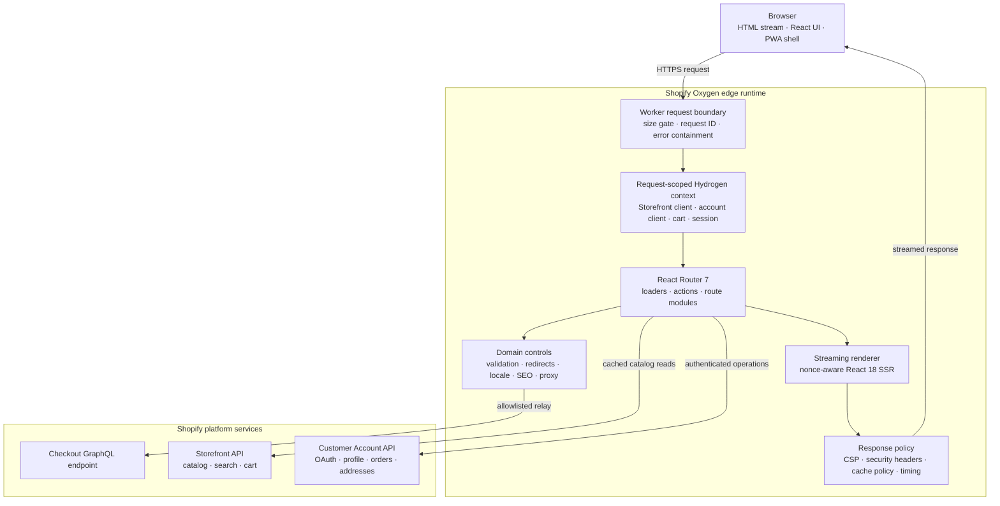
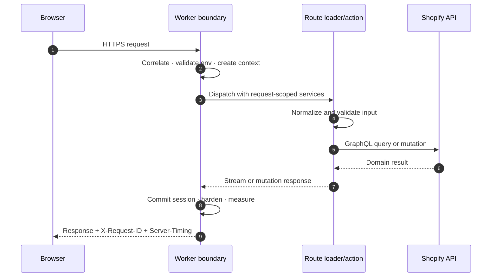
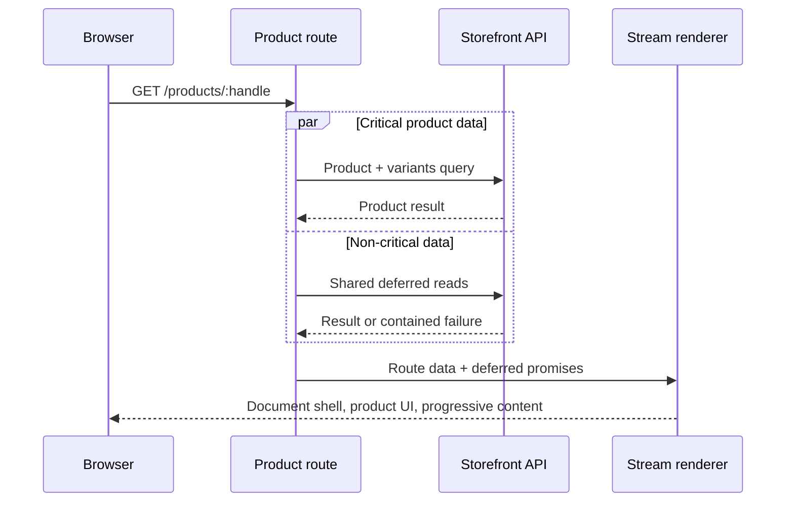
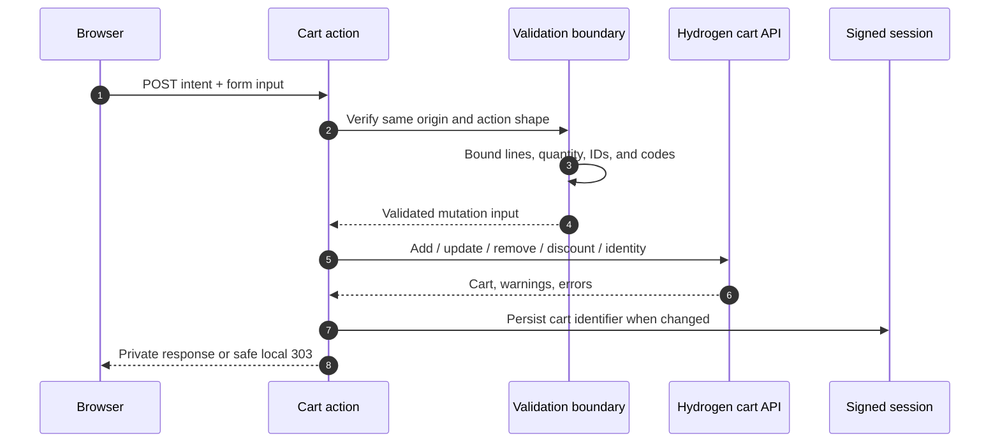
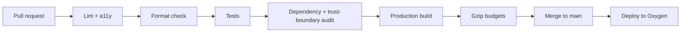

<div align="center">


<sub><strong>THE VISUAL THESIS</strong> — precision infrastructure beneath an electric, conversion-led commerce experience</sub>

# YAS Store

<sub>TECHNICAL WHITEPAPER · RELEASE 2026.9.0</sub>

### The production reference architecture for edge-native Shopify commerce

**Streaming storefront delivery, a centralized zero-trust boundary, and measurable quality gates—built on Shopify Hydrogen and designed for Oxygen.**

[](https://github.com/YASLOGIST/as-store-v1yas-frontend/actions/workflows/ci.yml)
[](https://nodejs.org)
[](https://shopify.dev/docs/custom-storefronts/hydrogen)
[](https://reactrouter.com)
[](./LICENSE)

[**Architecture**](#system-architecture) · [**Features**](#feature-matrix) · [**Workflows**](#core-workflows) · [**Stack**](#tech-stack) · [**Security**](#security-performance-and-discovery) · [**Quickstart**](#run-locally)

<br>

[](#verified-engineering-baseline)
[](#system-architecture)
[](#request-lifecycle)

</div>

---

> **Executive position**
>
> YAS Store is not a theme with an API attached. It is a server-rendered commerce system in which delivery, security, observability, search, cart state, account state, SEO, and accessibility are treated as one operating model. The result is a storefront foundation that can move from evaluation to production without a second architecture pass.

## Executive Brief

YAS Store is engineered for teams that need Shopify's commerce platform without surrendering control of frontend performance, interface quality, or request security. React is streamed from the edge; Shopify clients and signed sessions are created per request; mutations cross explicit validation boundaries; and every production change is evaluated against tests, security checks, and gzip budgets.

| Business requirement | Engineering response | Practical outcome |
|---|---|---|
| Fast first render | Edge SSR, streamed HTML, deferred non-critical data, route-level code splitting | Useful UI arrives before every downstream query has completed |
| Safe commerce mutations | Same-origin enforcement, bounded inputs, validated Shopify IDs, local-only commerce redirects | Cart operations fail closed at the trust boundary |
| Predictable operations | Correlation IDs, `Server-Timing`, structured privacy-safe logs, explicit cache policy | Incidents can be traced without logging customer input or credentials |
| Durable acquisition | Canonicals, OpenGraph/Twitter metadata, JSON-LD, sitemaps, robots controls | Product and editorial surfaces are machine-readable and crawlable |
| Controlled frontend growth | CI-enforced JavaScript and CSS gzip ceilings | Performance regressions become build failures, not backlog items |
| Inclusive global UX | Semantic controls, focus-managed drawers, live regions, RTL-aware document shell | Keyboard, assistive-technology, reduced-motion, and RTL use cases are first-class |

### Reading the cover image

The cover is a compact expression of the system rather than decorative branding. Its **perspective grid** represents the governed platform layer: predictable routing, contracts, budgets, and observability. The **violet-to-cyan spectrum** maps the product's progression from brand expression to fast digital delivery. The **hexagonal enclosure** signals a bounded trust perimeter, while the **lightning mark** communicates edge execution and low-latency commerce. Orbital lines imply Shopify services moving through a stable request boundary—not point-to-point integrations leaking into the interface.

| Visual signal | Engineering meaning | Customer value |
|---|---|---|
| Structured grid | Repeatable architecture and measurable quality gates | A platform that can scale without visual or operational drift |
| Electric gradient | The Volt token system and progressive experience states | A distinctive, consistent interface across every journey |
| Bounded hexagon | Centralized security, validation, session, and cache policy | Safer transactions and more dependable account experiences |
| Lightning core | Oxygen edge delivery, streaming SSR, and deferred data | Faster useful rendering and a shorter path to purchase |
| Orbital paths | Request-scoped access to Shopify commerce services | Integrated catalog, cart, checkout, and customer state |

> **Design principle:** visual energy belongs at the experience layer; complexity remains contained behind explicit technical boundaries.

### Verified engineering baseline

The repository's [acceptance record](./docs/ACCEPTANCE.md) documents the following baseline:

| Signal | Baseline | Enforcement |
|---|---:|---|
| Automated tests | **69** across 10 files | `npm test` |
| Security-focused checks | **26**, included in the full suite | `npm run check:security` |
| Lint and accessibility warnings | **0** | `npm run lint` · `npm run check:a11y` |
| Largest JavaScript asset | **≤ 50 KiB gzip** | `npm run check:performance` |
| Total client JavaScript | **≤ 150 KiB gzip** | `npm run check:performance` |
| Total CSS | **≤ 12 KiB gzip** | `npm run check:performance` |
| Known dependency advisories at verification | **0** | `npm run audit:security` |

---

## System Architecture

### Architecture at a glance



### Responsibility model

| Layer | Owns | Deliberately does not own |
|---|---|---|
| `server.js` | Request correlation, declared 1 MiB body rejection, context creation, session commit, Shopify redirects, safe failure response | Route-specific business behavior |
| `app/lib/http.js` | Security headers, sensitive-route cache policy, origin checks, safe redirects, timing, sanitized request logs | Rendering and Shopify queries |
| `app/lib/context.js` | Runtime configuration validation, request-scoped Shopify clients, cache, cart, and signed session | Global mutable application state |
| React Router route modules | Page data, mutations, metadata, response semantics | Cross-cutting transport policy |
| `app/lib/*` domain modules | Input contracts, proxy isolation, navigation safety, locale, search state, SEO schemas | UI composition |
| React component layer | Progressive enhancement, accessibility, analytics events, interaction state | Secret handling or direct privileged API access |
| Shopify services | Catalog, customer identity, cart persistence, checkout | Storefront presentation and edge policy |

### Request lifecycle

Every request follows the same path:

1. **Identify** — accept a syntactically safe upstream request ID or issue a new UUID.
2. **Reject early** — requests declaring a body larger than 1 MiB receive `413` before route dispatch.
3. **Validate configuration** — required domains, tokens, and session secrets fail fast without echoing secret values.
4. **Create isolated context** — cache, signed session, Storefront API, Customer Account API, and cart helpers are instantiated for that request.
5. **Dispatch** — React Router selects a loader or action; domain modules validate untrusted input before Shopify receives it.
6. **Render or mutate** — catalog reads use Shopify caching; sensitive operations are explicitly private and non-cacheable.
7. **Stream** — React 18 returns a nonce-aware HTML stream. Bots wait for complete rendering; browsers can receive progressive output.
8. **Harden and observe** — the boundary applies headers without buffering the stream, emits timing, and records a privacy-safe request event when required.



### Architectural invariants

- **No shared request state.** Shopify clients and session state are scoped to a single request.
- **No unbounded commerce input.** Search terms, result limits, cart lines, quantities, codes, IDs, and proxy bodies have explicit contracts.
- **No open redirects.** User-influenced destinations resolve only to same-origin paths.
- **No public caching of customer state.** Account, cart, discount, API, and cookie-setting responses are forced to `private, no-store`.
- **No stream buffering for hardening.** Response streams are rewrapped so policy headers remain writable while progressive delivery is preserved.
- **No sensitive diagnostic payloads.** Logs omit cookies, tokens, query strings, headers, customer input, and stack details.
- **No silent budget drift.** CI fails when JavaScript or CSS crosses its gzip ceiling.

For the behavioral specification and evidence map, see [`docs/ARCHITECTURE.md`](./docs/ARCHITECTURE.md).

---

## Feature Matrix

### Commerce and customer experience

| Capability | Implementation | Value delivered |
|---|---|---|
| Product discovery | Full and predictive search across products, collections, pages, articles, and query suggestions | Faster paths from intent to inventory |
| Product merchandising | Variant selection, availability, compare-at pricing, sale/sold-out states, image treatment, breadcrumbs | Decision-critical product data remains visible and actionable |
| Quick add | Product-card add-to-cart with optimistic interaction and valid non-nested controls | Lower-friction conversion from listing surfaces |
| Cart management | Add, update, remove, discount, gift card, buyer identity, cart permalinks | Complete cart lifecycle without abandoning the storefront shell |
| Customer accounts | OAuth login, profile, addresses, order history, order detail, logout | Shopify-managed identity with a first-party frontend experience |
| Content commerce | Blogs, articles, CMS pages, policies, collections, and products | Editorial and transactional journeys share one delivery system |
| Progressive sharing | Native share sheet, then clipboard, then selectable-link fallback | Share behavior degrades cleanly across browsers |
| PWA shell | PWA-ready manifest, standard and maskable icons, theme metadata | App-like presentation without making installation a dependency |

### Experience quality

| Capability | Implementation | Operational standard |
|---|---|---|
| Streaming states | Shape-matched skeletons and deferred below-the-fold data | Non-critical upstream failure does not block the primary page |
| Navigation feedback | Visual progress plus polite live-region status | Route changes remain perceivable without delaying navigation |
| Keyboard interaction | `/` search focus, `Ctrl/⌘ + K` predictive search, `Esc` close/restore | Primary discovery paths work without a pointer |
| Focus management | Trapped dialogs, scroll lock, focus restoration, unique labels | Drawers behave as accessible modal interfaces |
| Motion preferences | `prefers-reduced-motion` fallbacks across decorative movement | Animation is enhancement, never a usability requirement |
| Locale shell | Validated `lang`; automatic RTL direction for recognized locales | Document semantics adapt safely to locale context |
| Error states | Distinct guidance, no-results, recoverable upstream, 404, and production-safe 500 views | Failures are explicit without exposing internals |
| Responsive design | Fluid type, spacing, containers, and touch-oriented controls | One system scales from mobile to ultrawide displays |

### Platform capabilities

| Domain | Capability | Implementation evidence |
|---|---|---|
| Security | Centralized response hardening and nonce-based CSP | `server.js`, `app/entry.server.jsx`, `app/lib/http.js` |
| Session integrity | Signed `HttpOnly`, `SameSite=Lax`, secure `__Host-` cookie in HTTPS; multi-secret rotation | `app/lib/session.js`, `app/lib/env.js` |
| Proxy isolation | POST-only checkout relay, validated domain/version, 256 KiB body limit, header allowlist | `app/lib/proxy.js` |
| Search safety | NFKC normalization, control-character removal, 100-code-point term limit, bounded result count | `app/lib/validation.js` |
| Commerce safety | Shopify resource-ID checks, maximum 25 lines, quantity ceiling of 99 | `app/lib/validation.js` |
| SEO | Canonicals, social metadata, Product/Collection/Article/Breadcrumb/WebSite JSON-LD | `app/lib/seo.js` |
| Crawl control | Generated `robots.txt`, sitemap index, paginated resource sitemaps, `noindex` for private/utility surfaces | `app/routes/[robots.txt].jsx`, sitemap and route metadata |
| Observability | Validated correlation IDs, `Server-Timing`, minimal structured logs | `app/lib/http.js` |
| Quality automation | Lint, a11y, formatting, tests, dependency audit, build, bundle budgets | `.github/workflows/ci.yml` |
| Type safety | Storefront and Customer Account GraphQL declarations plus React Router type generation | generated `.d.ts` files, `npm run codegen` |

---

## Core Workflows

### Workflow contract

| Workflow | Entry point | Critical path | Failure and cache policy |
|---|---|---|---|
| Catalog render | `GET /products/:handle` or collection/content route | Worker → loader → Storefront API → streamed SSR | Catalog reads may cache; missing resources return route-level 404 |
| Predictive search | `GET /search?predictive&q=…` | Normalize term → clamp limit → Storefront API → typed result buckets | Empty and upstream-error states remain distinct; search is `noindex` |
| Cart mutation | `POST /cart` | Same-origin check → parse intent → validate input → Hydrogen cart mutation | Invalid input returns `400`, foreign origin `403`; response is private/no-store |
| Account authentication | `GET /account/login` and OAuth callback | Customer Account authorize → callback → authenticated account client | OAuth errors remain within the account flow; account responses are private |
| Checkout relay | `POST /api/:version/graphql.json` | Origin check → method/version/domain/body validation → allowlisted fetch | No inbound cookies or authorization headers are forwarded; no-store response |
| Edge delivery | Any document request | Context → route data → React stream → security headers | Production exceptions become generic `500`; stack details remain server-side |
| Release | Pull request or push to `main` | Install → static gates → tests → audit → build → bundle budgets → Oxygen | A failed gate blocks delivery; only the default branch deploys |

### 1. Catalog rendering

The route loader requests only the data required by the selected surface. Shared header data is critical; footer, cart, and login state can resolve independently. Deferred reads such as footer data contain upstream failures instead of converting the entire document into a `500`.



**Conversion property:** the buy path depends on product and variant truth, not on footer content or other deferred data.

### 2. Search and discovery

1. Normalize input with Unicode NFKC, remove controls, collapse whitespace, and cap it at 100 code points.
2. Choose regular or predictive query mode from the request.
3. Bound predictive result limits to `1…10`; regular product results paginate in groups of eight.
4. Query typed Shopify result buckets.
5. Return exactly one of four coherent states: initial guidance, results, no matches, or recoverable upstream failure.
6. Announce status through a single polite live region and keep search pages out of the index.

**Conversion property:** discovery remains fast and understandable while malformed or excessive input is stopped before reaching Shopify.

### 3. Cart mutation



**Integrity property:** a request can mutate only supported cart operations with bounded Shopify identifiers and quantities. Redirects cannot escape the storefront origin.

### 4. Customer account lifecycle

Authentication delegates credentials to Shopify's Customer Account API. The storefront initiates authorization, receives the OAuth callback through Hydrogen's account client, and resolves authenticated account state per request. Profile, address, and order routes operate through that authenticated client and are never publicly cached.

**Trust property:** the storefront integrates Shopify-managed identity and account state without implementing a parallel credential system.

### 5. Continuous delivery



Every pull request runs the same deterministic controls expected before release. The deployment workflow publishes only from `main` and requires the repository's Oxygen deployment secret.

---

## Tech Stack

| Layer | Technology | Version / contract | Why it is here |
|---|---|---|---|
| Commerce framework | Shopify Hydrogen | `2026.4.5` | Storefront primitives, GraphQL clients, cart, analytics, CSP, Oxygen integration |
| UI runtime | React + React DOM | `18.3.1` | Server streaming, Suspense-compatible rendering, progressive hydration |
| Routing and data | React Router | `7.18.4` | File routes, loaders, actions, metadata, errors, and server request handling |
| Edge runtime | Shopify Oxygen / MiniOxygen | Oxygen Workers / `4.2.3` local runtime | Globally distributed execution with a production-like local environment |
| API layer | Shopify Storefront API | GraphQL, generated declarations | Catalog, search, cart, content, and merchandising data |
| Identity layer | Shopify Customer Account API | OAuth + GraphQL | Customer profile, addresses, authentication, and orders |
| Query language | GraphQL | `^16.14.2` | Explicit commerce data contracts and generated operation types |
| Build system | Vite | `6.4.3`, ES2022 target | Fast local iteration, SSR/client bundling, CSS splitting |
| Test runner | Vitest | `^5.0.2` | Fast executable contracts for domain modules and primary storefront flows |
| Static analysis | ESLint | `^9.18.0` | React, hooks, import, Jest, and JSX accessibility rules |
| Formatting | Prettier + Shopify config | Prettier `^3.4.2` | Stable source formatting shared with Shopify conventions |
| Type generation | Hydrogen Codegen + React Router typegen | Build-time | Storefront API, Customer Account API, and route declarations |
| Application language | Modern JavaScript + JSX | ESM, JSDoc, generated `.d.ts` | Runtime simplicity with editor and API contract coverage |
| Styling | Native CSS | Custom properties, no runtime CSS framework | Small payload, deterministic cascade, complete design-system ownership |
| Runtime baseline | Node.js + npm | Node `≥22`, npm `10.9.8` | Reproducible local and CI toolchain |

### The Volt interface system

Volt is a dark, high-contrast commerce system implemented in native CSS. It uses a constrained token layer for color, type, space, radius, shadow, glass, duration, and easing; fluid sizing with `clamp()`; and a small utility vocabulary for buttons, badges, skeletons, labels, and reveal states.

| Contract | Implementation |
|---|---|
| Brand | Violet-to-cyan accent system on a deep neutral canvas |
| Payload | Complete CSS ceiling of **12 KiB gzip**, enforced in CI |
| Motion | Three duration tiers, spring easing, reduced-motion fallbacks |
| Layout | Fluid gutters and containers from mobile through ultrawide |
| Delivery | External assets only; CSS code splitting; no runtime style injection |
| Preview | [`guides/design-preview.html`](./guides/design-preview.html) |

---

## Security, Performance, and Discovery

### Security controls

| Boundary | Control |
|---|---|
| Transport | HSTS on production HTTPS; deny framing; MIME sniff protection; strict referrer policy |
| Content execution | Hydrogen-generated nonce CSP; nonce propagated through React rendering and scripts |
| Browser capabilities | Restrictive permissions policy, opener policy, origin-agent clustering |
| Mutation origin | Foreign `Origin` or cross-site browser fetch metadata rejected with `403` |
| Sessions | Signed, HTTP-only, same-site cookies; secure `__Host-` naming on HTTPS; secret rotation |
| Inputs | Explicit bounds and resource patterns for search, cart, commerce codes, API versions, and domains |
| Redirects | Relative same-origin paths only; protocol-relative, foreign, backslash, and control-character targets rejected |
| Checkout proxy | POST-only, 256 KiB body ceiling, strict outbound header allowlist, narrow response-header forwarding |
| Caching | Sensitive paths and cookie-setting responses forced to `private, no-store, max-age=0` |
| Failure disclosure | Generic production error body; no stack trace or thrown payload serialization |
| Diagnostics | Path-only structured logs with request ID, method, status, duration, and error class name |

Security behavior is pinned by executable tests in `app/lib/http.test.js`, `proxy.test.js`, and `validation.test.js`. Report vulnerabilities through [`SECURITY.md`](./SECURITY.md).

### Performance budgets

[`scripts/check-bundle.mjs`](./scripts/check-bundle.mjs) measures the production output itself—not source estimates.

| Asset class | Gzip ceiling | Intent |
|---|---:|---|
| Largest JavaScript asset | **50 KiB** | Bound route-level parse and execution cost |
| All client JavaScript | **150 KiB** | Keep the complete interaction layer intentionally small |
| All CSS | **12 KiB** | Preserve a compact, cacheable visual system |

The implementation reinforces these budgets with route splitting, external assets (`assetsInlineLimit: 0`), CSS splitting, cached catalog reads, deferred non-critical queries, and streamed SSR.

### Search and crawl model

- Product, collection, article, breadcrumb, and website data are emitted as schema.org JSON-LD.
- Public routes receive canonical, OpenGraph, and Twitter metadata.
- `robots.txt`, a sitemap index, and paginated resource sitemaps are generated at the edge.
- Cart, search, and account surfaces are marked `noindex` so crawl budget stays focused on public content.

---

## Run Locally

### Prerequisites

- Node.js **22 or newer**
- npm **10.x**
- A Shopify store with the **Headless** sales channel
- Storefront API credentials; Customer Account credentials are optional unless account flows are required

### Install and start

```bash
git clone https://github.com/YASLOGIST/as-store-v1yas-frontend.git
cd as-store-v1yas-frontend
npm ci

cp .env.example .env
openssl rand -base64 32   # use this output for SESSION_SECRET

npm run dev
```

The development command runs Shopify Hydrogen with GraphQL code generation and hot reload. Open the URL printed by the CLI.

### Environment contract

| Variable | Required | Purpose |
|---|:---:|---|
| `PUBLIC_STORE_DOMAIN` | Yes | Shopify store hostname, for example `store.myshopify.com` |
| `PUBLIC_STOREFRONT_API_TOKEN` | Yes | Public Storefront API access token |
| `PUBLIC_CHECKOUT_DOMAIN` | Yes | Validated checkout hostname |
| `SESSION_SECRET` | Yes | Cookie signing secret, minimum 32 characters |
| `PUBLIC_STOREFRONT_ID` | No | Storefront public ID for web pixel analytics |
| `PUBLIC_CUSTOMER_ACCOUNT_API_CLIENT_ID` | No | Enables Customer Account API flows |

For zero-downtime session-secret rotation, use `NEW_SECRET,PREVIOUS_SECRET`. The first value signs new cookies; remaining values continue validating existing cookies. Runtime validation reports missing or malformed configuration by variable name and never echoes values.

### Operational commands

| Intent | Command | Result |
|---|---|---|
| Develop | `npm run dev` | Hydrogen development server, codegen, hot reload |
| Generate types | `npm run codegen` | Storefront, customer account, and route declarations |
| Test | `npm test` | Full Vitest suite |
| Test continuously | `npm run test:watch` | Vitest watch mode |
| Lint | `npm run lint` | ESLint across the repository |
| Accessibility gate | `npm run check:a11y` | JSX semantics and document contracts, zero warnings |
| Format | `npm run format` | Write Prettier formatting |
| Validate format | `npm run format:check` | Check formatting without modifying files |
| Security gate | `npm run check:security` | Dependency audit plus boundary-focused tests |
| Full quality gate | `npm run check` | Lint, format, tests, and dependency audit |
| Production build | `npm run build` | Code generation plus Hydrogen build; credentials required |
| CI build | `npm run build:ci` | Credential-free Hydrogen production build |
| Enforce budgets | `npm run check:performance` | Measure built client assets against gzip ceilings |
| Full pre-PR verification | `npm run verify` | Quality gate plus production build |
| Preview | `npm run preview` | Build and run in the local Oxygen-like runtime |

To validate the toolchain without connecting a store:

```bash
npm run check
npm run build:ci
npm run check:performance
```

`check:performance` expects the output produced by `build:ci` or `build`.

---

## Repository Anatomy

```text
.
├── app/
│   ├── components/            UI, commerce controls, accessibility primitives
│   ├── graphql/               Customer Account API operations
│   ├── lib/                   Trust boundaries, domain rules, SEO, sessions
│   ├── routes/                File-based storefront and API routes
│   ├── styles/                Reset and Volt design system
│   ├── tests/                 Route-level commerce flow contracts
│   ├── entry.client.jsx       Browser hydration entry
│   ├── entry.server.jsx       Streaming SSR and nonce CSP
│   └── root.jsx               Document shell and shared application data
├── docs/                      Architecture, audit, acceptance evidence
├── guides/                    Search guides and visual-system preview
├── public/                    Manifest, icons, and social image
├── scripts/check-bundle.mjs   Production gzip budget enforcement
├── server.js                  Oxygen worker and global request boundary
└── .github/workflows/         CI and Oxygen deployment
```

### Route surface

| Surface | Routes |
|---|---|
| Home and catalog | `/`, `/products/:handle`, `/collections`, `/collections/:handle`, `/collections/all` |
| Discovery | `/search`, predictive search through the same loader |
| Cart and promotions | `/cart`, `/cart/:lines`, `/discount/:code` |
| Content | `/blogs`, `/blogs/:blog`, `/blogs/:blog/:article`, `/pages/:handle`, `/policies/*` |
| Account | `/account/*`, `/account/login`, `/account/authorize`, `/account/logout` |
| Platform | `/api/:version/graphql.json`, `/robots.txt`, `/sitemap.xml`, `/sitemap/:type/:page.xml` |

---

## Evaluation and Adoption

A pragmatic evaluation can be completed in four passes:

1. **Inspect the architecture** — review [`docs/ARCHITECTURE.md`](./docs/ARCHITECTURE.md) and the trust-boundary modules under `app/lib/`.
2. **Run the deterministic gates** — `npm ci`, `npm run check`, `npm run build:ci`, then `npm run check:performance`.
3. **Connect a Shopify store** — populate `.env`, start the app, and execute the configured-store checks in [`docs/ACCEPTANCE.md`](./docs/ACCEPTANCE.md).
4. **Validate release mechanics** — configure the Oxygen deployment secret and use the existing protected delivery path from pull request to `main`.

This sequence separates source-level confidence from store-specific integration, making adoption risk visible before production traffic is involved.

## Documentation

| Document | Scope |
|---|---|
| [`docs/ARCHITECTURE.md`](./docs/ARCHITECTURE.md) | System behavior, primary flows, invariants, evidence map |
| [`docs/AUDIT.md`](./docs/AUDIT.md) | Reverse-engineering audit, findings, and resolutions |
| [`docs/ACCEPTANCE.md`](./docs/ACCEPTANCE.md) | Automated baseline and configured-store regression checklist |
| [`CHANGELOG.md`](./CHANGELOG.md) | Release history |
| [`SECURITY.md`](./SECURITY.md) | Security policy and responsible disclosure |
| [`guides/predictiveSearch/`](./guides/predictiveSearch) | Predictive search implementation guidance |
| [`guides/search/`](./guides/search) | Full search implementation guidance |

External references: [Hydrogen](https://shopify.dev/docs/custom-storefronts/hydrogen) · [Storefront API](https://shopify.dev/docs/api/storefront) · [Customer Account API](https://shopify.dev/docs/api/customer) · [React Router](https://reactrouter.com/)

---

## Contributing

1. Branch from `main`.
2. Add executable coverage for new behavior, especially at trust boundaries.
3. Run `npm run verify` before opening a pull request.
4. Confirm the CI build and bundle-budget gate pass without warnings.

Changes that weaken validation, bypass cache policy, expose sensitive diagnostics, or exceed performance budgets are not release-ready.

<div align="center">

**YAS Store** — commerce at the edge, governed like infrastructure.

Released under the [MIT License](./LICENSE).

</div>
