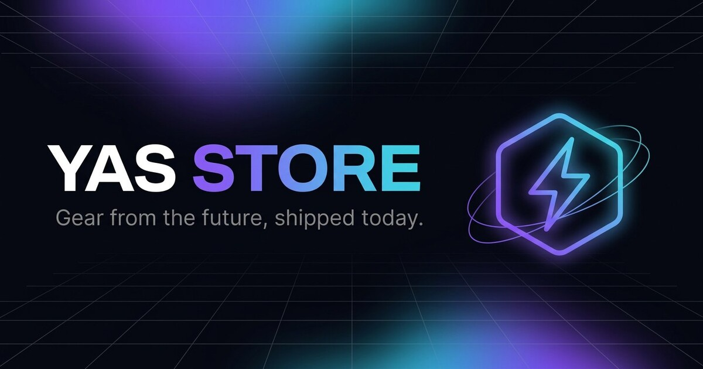

# YAS Store — Hydrogen Storefront

A high-tech Shopify storefront built on **Hydrogen 2026.1** and **React Router 7** —
server-rendered at the edge, streamed for instant loads, and dressed in a custom
"Volt" dark design system.



## ✨ What's inside

**Experience**

- 🎨 **"Volt" design system** — dark, glassmorphic theme with aurora gradients,
  tech-grid hero, fluid typography and motion built on CSS custom properties
- ⚡ **Quick add-to-cart** — one-tap add from any product card with optimistic
  cart updates (stretched-link cards, valid HTML, no nested interactives)
- 🔍 **Predictive search** — as-you-type results for products, collections,
  pages and articles in a slide-in drawer
- 💀 **Skeleton loaders** — shimmering placeholders that mirror streamed content
- 🏷️ **Smart product cards** — Sale / Sold-out badges, compare-at price strikes,
  image zoom on hover, scroll-driven reveal animations (progressive enhancement)
- 📱 **PWA-ready** — web manifest, maskable icons, theme color, SVG favicon
- 🧭 **Breadcrumbs** on product and collection pages

**Engineering**

- 🧪 **Vitest test suite** — unit tests for SEO helpers, order filters and
  search utilities (`npm test`)
- 🚦 **CI pipeline** — lint + format check + tests + build on every PR
- 🧹 **Zero-lint codebase** — ESLint (React, a11y, hooks, imports) passes clean
- 📐 **Prettier** with Shopify's shared config (`npm run format`)
- 🔒 **Security headers** — `X-Content-Type-Options`, `Referrer-Policy`,
  `Permissions-Policy` on every response, plus nonce-based CSP from Hydrogen
- 🔎 **SEO toolkit** (`app/lib/seo.js`) — JSON-LD structured data for Products,
  Collections, Articles, Breadcrumbs and WebSite + full OpenGraph/Twitter meta
  on every route, `noindex` on cart/search/account pages

## 🚀 Getting started

**Requirements:** Node.js ≥ 20

```bash
npm install
cp .env.example .env    # fill in your store credentials
npm run dev             # start the dev server with codegen
```

Open the printed URL (typically `http://localhost:3000`).

### Environment variables

See [`.env.example`](./.env.example) for the full list. Values come from your
Shopify admin under **Settings → Apps and sales channels → Headless**.

## 📜 Scripts

| Script                  | What it does                                          |
| ----------------------- | ----------------------------------------------------- |
| `npm run dev`           | Dev server with hot reload + GraphQL codegen          |
| `npm run build`         | Production build (with codegen — needs credentials)   |
| `npm run preview`       | Build + preview in a local Oxygen-like worker         |
| `npm run lint`          | ESLint across the app                                 |
| `npm run format`        | Prettier write                                        |
| `npm run format:check`  | Prettier check (used in CI)                           |
| `npm test`              | Run the Vitest unit test suite                        |
| `npm run test:watch`    | Watch mode                                            |
| `npm run codegen`       | Regenerate Storefront API + route types               |
| `npm run verify`        | lint + format:check + test + build                    |

## 🏗️ Project structure

```
├── app/
│   ├── assets/            # favicon / logo mark (SVG)
│   ├── components/        # UI components (Header, Footer, ProductItem, …)
│   │   ├── Icons.jsx      # inline SVG icon set
│   │   ├── Skeleton.jsx   # suspense placeholders
│   │   └── StructuredData.jsx # JSON-LD renderer
│   ├── graphql/           # Customer Account API queries
│   ├── lib/               # helpers — seo.js, session, search, variants…
│   │   └── *.test.js      # Vitest unit tests (co-located)
│   ├── routes/            # file-based routes (React Router 7)
│   ├── styles/            # reset.css + app.css (the Volt design system)
│   ├── root.jsx           # document shell, SEO defaults, error boundary
│   └── server.js → ../    # Oxygen worker entry (security headers)
├── public/                # static assets, manifest, PWA icons
└── .github/workflows/     # CI + Oxygen deploy
```

## 🎨 Design system

All theme tokens live at the top of [`app/styles/app.css`](./app/styles/app.css):

```css
:root {
  --bg: #05060c;        /* deep space background        */
  --accent: #7c5cff;    /* volt violet                  */
  --accent-2: #22d3ee;  /* cyan                         */
  --gradient: linear-gradient(120deg, #7c5cff, #4b7bff 48%, #22d3ee);
  --font-mono: ui-monospace, 'SF Mono', 'JetBrains Mono', …;
  /* … spacing, radii, shadows, motion curves */
}
```

Utilities: `.btn`, `.btn-primary`, `.badge`, `.eyebrow`, `.gradient-text`,
`.reveal` (scroll-driven animations via `animation-timeline: view()`),
`.skeleton`. All motion respects `prefers-reduced-motion`.

## 🚢 Deployment

Pushes to `main` deploy automatically to **Shopify Oxygen** via the pre-configured
GitHub workflow (requires the `OXYGEN_DEPLOYMENT_TOKEN` secret). See
[Shopify's Hydrogen deployment docs](https://shopify.dev/docs/custom-storefronts/hydrogen/deployment)
for details.

## 📚 Learn more

- [Hydrogen docs](https://shopify.dev/docs/custom-storefronts/hydrogen)
- [React Router 7](https://reactrouter.com/)
- [Storefront API](https://shopify.dev/docs/api/storefront)
- [Customer Account API](https://shopify.dev/docs/api/customer)

## License

MIT — see [SECURITY.md](./SECURITY.md) for responsible disclosure.
