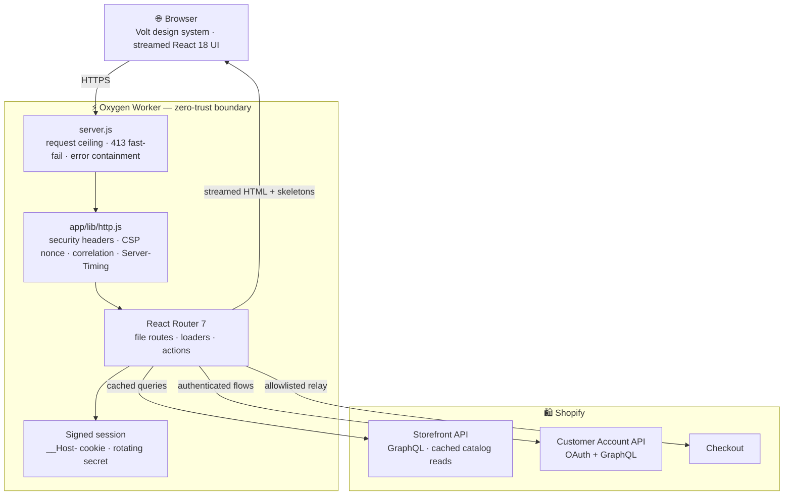
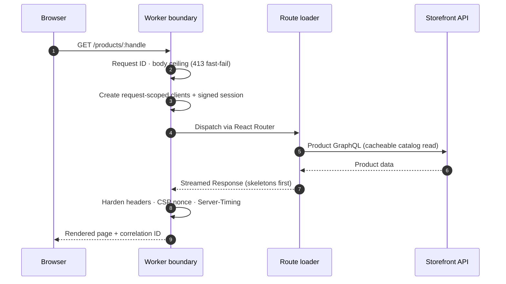
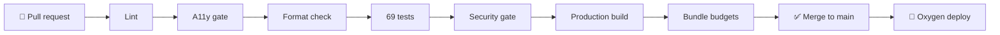

<div align="center">


# ⚡ YAS Store

**A production-grade, edge-rendered Shopify storefront — engineered like infrastructure.**

Server-rendered at the edge on **Hydrogen 2026.4.5** · streamed for instant loads ·
wrapped in a zero-trust request boundary · dressed in the custom **“Volt”** dark design system.

[](https://github.com/YASLOGIST/as-store-v1yas-frontend/actions/workflows/ci.yml)
[](https://nodejs.org)
[](https://shopify.dev/docs/custom-storefronts/hydrogen)
[](https://reactrouter.com)
[](#-testing-strategy)
[](#-security-model)
[](./LICENSE)

**[Quick start](#-quick-start) · [Architecture](#-architecture) · [Security](#-security-model) · [Design system](#-the-volt-design-system) · [Docs](#-documentation-map)**

</div>

---

## 📑 Table of contents

| # | Section | What you'll learn |
|---|---------|-------------------|
| 1 | [Why this exists](#-why-this-exists) | The engineering philosophy behind the build |
| 2 | [By the numbers](#-by-the-numbers) | Hard, CI-enforced quality metrics |
| 3 | [Feature matrix](#-feature-matrix) | Everything the storefront does, at a glance |
| 4 | [Architecture](#-architecture) | System topology + request lifecycle diagrams |
| 5 | [Quick start](#-quick-start) | From clone to running storefront in minutes |
| 6 | [Environment variables](#-environment-variables) | Every variable, its purpose and source |
| 7 | [Commands](#-commands) | The full operational toolkit, grouped by intent |
| 8 | [Project structure](#-project-structure) | Annotated source tree |
| 9 | [Volt design system](#-the-volt-design-system) | Tokens, utilities and motion contracts |
| 10 | [Security model](#-security-model) | The zero-trust boundary, layer by layer |
| 11 | [Performance](#-performance-budgets) | Bundle budgets and why they're enforced |
| 12 | [Testing strategy](#-testing-strategy) | What 69 tests actually protect |
| 13 | [SEO engine](#-seo-engine) | Structured data, meta and crawl surfaces |
| 14 | [Deployment](#-deployment) | Continuous delivery to Shopify Oxygen |
| 15 | [Documentation map](#-documentation-map) | Deep-dive docs in this repository |
| 16 | [Contributing](#-contributing) | How to ship changes safely |

---

## 🎯 Why this exists

Most storefront templates optimize for *time-to-demo*. **YAS Store optimizes for time-to-production** — the day-one posture of a real commerce platform:

> **Every request is untrusted. Every millisecond is budgeted. Every regression is tested. Every page is crawlable.**

Four pillars hold this up:

1. **⚡ Edge-first rendering** — React 18 streams from the Oxygen worker runtime; skeletons mirror the streamed content so the page *feels* instant before data arrives.
2. **🔒 Zero-trust by construction** — a single hardened boundary (`server.js` → `app/lib/http.js`) owns correlation IDs, security headers, CSP nonces, cookie policy and safe redirects. Security is not sprinkled across routes; it's centralized and *tested as code*.
3. **📐 Budgets, not vibes** — gzip budgets for JS and CSS are enforced in CI. If a change makes the storefront heavier, the build fails. Performance can't silently rot.
4. **🌍 Commerce-grade UX** — RTL-aware locale handling, keyboard-first search, focus-trapped drawers, `prefers-reduced-motion` support and accessible navigation feedback are baseline, not enhancements.

---

## 📊 By the numbers

Every metric below is **enforced by CI**, not aspirational:

| Metric | Value | Enforced by |
|--------|-------|-------------|
| Unit + flow tests passing | **69** across 10 files | `npm test` |
| Known dependency vulnerabilities | **0** | `npm run audit:security` |
| Lint / a11y warnings | **0** | `npm run lint`, `npm run check:a11y` |
| Largest JS route chunk (gzip) | **≤ 50 KiB** | `npm run check:performance` |
| Total client JavaScript (gzip) | **≤ 150 KiB** | `npm run check:performance` |
| Entire Volt CSS system (gzip) | **≤ 12 KiB** | `npm run check:performance` |
| Structured-data types emitted | **5** (Product, Collection, Article, BreadcrumbList, WebSite) | `app/lib/seo.js` |
| Security response headers applied | **10+** on every response | `app/lib/http.js` |
| Node.js engine | **≥ 22** | `package.json#engines` |

---

## ✨ Feature matrix

### 🛍️ Customer experience

| Feature | Detail |
|---------|--------|
| ⚡ Quick add-to-cart | One-tap add from any product card with optimistic cart updates — stretched-link cards keep the HTML valid (no nested interactives) |
| 🔍 Predictive search | As-you-type products, collections, pages and articles in a slide-in drawer; debounced traffic |
| 💀 Skeleton loaders | Shimmering placeholders that mirror streamed content shape-for-shape |
| 🏷️ Smart product cards | Sale / Sold-out badges, compare-at price strikes, hover image zoom, scroll-driven reveal |
| 🧭 Breadcrumbs | On product and collection pages, mirrored as JSON-LD |
| 🔗 Progressive sharing | Native share sheet → clipboard → selectable-link fallback |
| ⏳ Navigation feedback | Reduced-motion-safe progress bar + screen-reader status announcements |
| 🌍 Locale-aware shell | Validated document language; automatic RTL for Arabic, Hebrew, Persian, Urdu and related locales |
| 📱 PWA-ready | Web manifest, maskable icons, theme color, SVG favicon |
| ⌨️ Keyboard-first | <kbd>/</kbd> focuses search · <kbd>⌘</kbd>/<kbd>Ctrl</kbd>+<kbd>K</kbd> opens predictive search · <kbd>Esc</kbd> closes drawers and restores focus |
| 🎯 Focus management | Drawers trap and restore focus, lock scroll, carry unique labels |

### 🏗️ Engineering

| Capability | Detail |
|------------|--------|
| 🧪 Vitest suite | 69 tests: cart, product, search, HTTP hardening, proxy isolation, validation, locale, navigation, SEO + route-level storefront flows |
| 🚦 CI pipeline | Lint → a11y → format → tests → security audit → production build → bundle budgets, on every PR |
| 🔎 SEO toolkit | JSON-LD for Products, Collections, Articles, Breadcrumbs and WebSite; full OpenGraph/Twitter meta; `noindex` on cart/search/account |
| 🤖 Crawl surfaces | Edge-generated `robots.txt` + paginated `sitemap.xml` |
| 📐 Codegen | Storefront API + Customer Account API types regenerate with `npm run codegen` |
| 🧹 Zero-lint codebase | ESLint 9 (React, a11y, hooks, imports) passes with zero warnings |
| 📦 Deterministic builds | `build:ci` builds production bundles with no store credentials required |

### 🔐 Security & observability

| Control | Detail |
|---------|--------|
| 🛡️ Hardened boundary | Strict browser-origin checks, bounded payloads, safe local redirects, private cache policy |
| 🍪 Rotating sessions | `__Host-` prefixed, `Secure` · `HttpOnly` · `SameSite=Lax` cookies with comma-separated secret rotation |
| 🔀 Constrained proxy | Allowlisted checkout GraphQL relay: domain + API-version validation, 256 KiB ceiling, header allowlist, zero cookie/auth leakage |
| 📈 Edge diagnostics | Privacy-safe correlation IDs + `Server-Timing`; never logs cookies, tokens, query strings or customer input |
| 🧾 CSP | Nonce-based Content-Security-Policy; assets stay external so no `data:` fallbacks are ever needed |
| 🚫 Fast-fail | 1 MiB request ceiling at the worker — oversized bodies get an immediate `413`, never reach a route |

---

## 🏗️ Architecture

### System topology



### Request lifecycle

Every request walks the same hardened path — no route can bypass it:



**Key decisions, and why:**

- **Request-scoped everything** — GraphQL clients and sessions are created per request in `app/lib/context.js`; no shared mutable state at the edge.
- **Streaming over buffering** — the boundary re-wraps response *streams* (never buffers) so security headers stay writable while HTML flushes early.
- **Cache split** — catalog reads are cached; anything touching a session or a mutation is `Cache-Control: private` by policy.
- **One boundary, many tests** — `app/lib/http.test.js` and `app/lib/proxy.test.js` pin the trust contract in CI, so hardening can't regress silently.

The full behavioral specification (with per-flow sequence diagrams) lives in [`docs/ARCHITECTURE.md`](./docs/ARCHITECTURE.md).

---

## 🚀 Quick start

**Requirements:** Node.js ≥ 22 · npm 10+ · a Shopify store with Headless channel access

```bash
git clone https://github.com/YASLOGIST/as-store-v1yas-frontend.git
cd as-store-v1yas-frontend

npm install

cp .env.example .env      # fill in your store credentials (see next section)
openssl rand -base64 32   # generate your SESSION_SECRET

npm run dev               # dev server + GraphQL codegen + hot reload
```

Open the printed URL (typically `http://localhost:3000`).

**No store credentials yet?** You can still verify the whole toolchain:

```bash
npm run check             # lint + format + 69 tests + security audit
npm run build:ci          # credential-free production build
npm run check:performance # enforce gzip bundle budgets
```

---

## 🔐 Environment variables

Values come from your Shopify admin under
**Settings → Apps and sales channels → Headless**. Never commit real tokens.

| Variable | Required | Purpose |
|----------|:--------:|---------|
| `PUBLIC_STORE_DOMAIN` | ✅ | Your store's domain (e.g. `your-store.myshopify.com`) |
| `PUBLIC_STOREFRONT_API_TOKEN` | ✅ | Public Storefront API access token |
| `PUBLIC_CHECKOUT_DOMAIN` | ✅ | Checkout domain (usually same as store domain) |
| `SESSION_SECRET` | ✅ | Cookie signing secret, **min 32 chars** (`openssl rand -base64 32`). For zero-downtime rotation: `NEW_SECRET,PREVIOUS_SECRET` |
| `PUBLIC_STOREFRONT_ID` | ➖ | Storefront API public ID — enables web pixel analytics |
| `PUBLIC_CUSTOMER_ACCOUNT_API_CLIENT_ID` | ➖ | Customer Account API client ID — enables login/orders/addresses/profile |

Runtime configuration is validated in `app/lib/env.js`, which **fails fast with a precise message but never echoes secret values**.

---

## 🧰 Commands

### 🧑‍💻 Development

| Command | What it does |
|---------|--------------|
| `npm run dev` | Dev server with hot reload + GraphQL codegen |
| `npm run codegen` | Regenerate Storefront API + route types |
| `npm run format` | Prettier write (Shopify's shared config) |

### ✅ Quality

| Command | What it does |
|---------|--------------|
| `npm run lint` | ESLint across the app — React, a11y, hooks, imports |
| `npm run format:check` | Prettier check (used in CI) |
| `npm run check:a11y` | JSX accessibility + document contracts, **zero warnings enforced** |
| `npm test` | Run the full Vitest suite (69 tests) |
| `npm run test:watch` | Watch mode |

### 🔒 Security

| Command | What it does |
|---------|--------------|
| `npm run audit:security` | Audit the complete dependency graph (`--audit-level=high`) |
| `npm run audit:prod` | Audit the production-only dependency graph |
| `npm run check:security` | Dependency audit **+** trust-boundary test suites (HTTP, proxy, validation, flows) |

### 📦 Build & performance

| Command | What it does |
|---------|--------------|
| `npm run build` | Production build with codegen (needs credentials) |
| `npm run build:ci` | Credential-free production build (what CI runs) |
| `npm run preview` | Build + preview in a local Oxygen-like worker |
| `npm run check:performance` | Enforce gzip budgets against `dist/client` |

### 🚀 Compound gates

| Command | What it does |
|---------|--------------|
| `npm run check` | Lint + format + tests + full security audit |
| `npm run verify` | Everything in `check` **plus** a production build — run before every PR |

---

## 📁 Project structure

```
├── app/
│   ├── assets/                 # favicon / logo mark (SVG)
│   ├── components/             # UI components
│   │   ├── Icons.jsx           #   inline SVG icon set
│   │   ├── Skeleton.jsx        #   suspense placeholders
│   │   └── StructuredData.jsx  #   JSON-LD renderer
│   ├── graphql/                # Customer Account API queries
│   ├── lib/                    # domain + runtime modules (each tested)
│   │   ├── http.js             #   request boundary, headers, CSRF, tracing
│   │   ├── proxy.js            #   allowlisted checkout GraphQL relay
│   │   ├── validation.js       #   bounded commerce/search input contracts
│   │   ├── navigation.js       #   safe merchant-managed menu links
│   │   ├── seo.js              #   JSON-LD + meta generation
│   │   ├── session.js          #   rotating signed-cookie sessions
│   │   ├── env.js / context.js #   validated runtime config, request clients
│   │   └── *.test.js           #   co-located Vitest contracts
│   ├── routes/                 # file-based routes (React Router 7)
│   ├── styles/                 # reset.css + app.css (Volt design system)
│   ├── tests/                  # route-level storefront flow tests
│   └── root.jsx                # document shell, SEO defaults, error boundary
├── docs/                       # ARCHITECTURE · AUDIT · ACCEPTANCE
├── guides/                     # predictive search, search, design preview
├── public/                     # static assets, PWA manifest + icons
├── scripts/check-bundle.mjs    # gzip budget enforcement
├── server.js                  # Oxygen worker entry (the trust boundary)
└── .github/workflows/          # CI + Oxygen deployment
```

### Routes at a glance

| Route | Surface |
|-------|---------|
| `/` | Home — hero, featured collections |
| `/products/:handle` | Product page — variants, quantity, JSON-LD, sharing |
| `/collections/:handle` · `/collections/all` | Collection grid with pagination |
| `/search` | Full search results |
| `/cart` · `/cart/:lines` | Cart + cart permalinks |
| `/discount/:code` | Discount application |
| `/blogs/:blog/:article` | Blog + articles |
| `/pages/:handle` · `/policies/*` | CMS pages + policies |
| `/account/*` | Login/logout, orders, addresses, profile (Customer Account API) |
| `/api/:version/graphql.json` | Constrained checkout relay |
| `/robots.txt` · `/sitemap.xml` | Edge-generated crawl surfaces |

---

## 🎨 The Volt design system

A dark, glassmorphic, high-tech theme built entirely on **CSS custom properties** — no CSS framework, no runtime-injected styles, ~12 KiB gzipped total.

> Preview it standalone: open [`guides/design-preview.html`](./guides/design-preview.html) in a browser.

### Core tokens

| Token | Value | Role |
|-------|-------|------|
| `--bg` | `#05060c` | Deep-space canvas |
| `--bg-raised` / `--bg-glass` | `#0a0c16` / `rgba(13,16,28,.72)` | Elevated + frosted surfaces |
| `--accent` | `#7c5cff` | **Volt violet** — primary brand accent |
| `--accent-2` | `#22d3ee` | Cyan — secondary accent |
| `--gradient` | `120deg` violet → blue → cyan | The signature brand gradient |
| `--glow` | layered violet/cyan shadows | Neon glow for focus/hover states |
| `--blur` | `saturate(160%) blur(18px)` | Glassmorphism backdrop |
| `--ease-spring` | `cubic-bezier(.34,1.56,.64,1)` | Overshoot motion for reveals |
| `--font-mono` | SF Mono / JetBrains Mono / … | Technical voice for numbers + eyebrows |

Full set (spacing, radii, shadows, durations) lives at the top of [`app/styles/app.css`](./app/styles/app.css).

### Utility classes

`.btn` · `.btn-primary` · `.badge` · `.eyebrow` · `.gradient-text` · `.skeleton` ·
`.reveal` — scroll-driven entrance animations powered by `animation-timeline: view()`, **progressive enhancement** with a full `prefers-reduced-motion` fallback.

### Design contracts

- **Fluid typography & layout** — `clamp()`-based gutters and container scale from mobile to ultrawide.
- **Motion hierarchy** — three duration tiers (`--dur-fast`, `--dur`, `--dur-slow`) keep animation consistent, never arbitrary.
- **Contrast-first palette** — text tokens (`--text`, `--text-muted`, `--text-faint`) are tuned for WCAG-friendly contrast on the dark canvas.

---

## 🛡️ Security model

Security is implemented as **one tested boundary** — `server.js` → `app/lib/http.js` — that every request and response must cross. Routes never set their own policy.

<details>
<summary><b>🔬 Deep dive: the full control stack</b></summary>

| Layer | Control |
|-------|---------|
| Request entry | 1 MiB body ceiling → immediate `413`, fast-fail before routing |
| Origin | Strict browser-origin checks on every mutation (CSRF defense) |
| Redirects | Login/callback redirects restricted to safe local paths |
| Input | Bounded cart/search/discount inputs; strict cart-permalink parsing |
| Cookies | `__Host-` prefix · `Secure` · `HttpOnly` · `SameSite=Lax` · rotating signing secrets |
| Proxy | Checkout GraphQL relay: domain + API-version validation, 256 KiB ceiling, request-header allowlist, upstream status preserved, no cookie/auth-response leakage |
| Caching | `Cache-Control: private` forced on sensitive paths and any `Set-Cookie` response |
| Headers | `Content-Security-Policy` (nonce-based) · `Strict-Transport-Security` (max-age 1y, includeSubDomains, HTTPS prod) · `X-Frame-Options: DENY` · `X-Content-Type-Options: nosniff` · `Referrer-Policy: strict-origin-when-cross-origin` · locked `Permissions-Policy` · `Cross-Origin-Opener-Policy` · `Origin-Agent-Cluster` |
| Observability | Per-request correlation IDs (`X-Request-ID`) + `Server-Timing`; structured logs **never** contain cookies, tokens, query strings or customer input |
| Failure | Production errors return a safe generic message — stack traces never leak |
| Dependencies | Patched routing/runtime packages, constrained transitive overrides, zero-advisory CI gate |

</details>

**Verification is code, not documentation.** `app/lib/http.test.js`, `app/lib/proxy.test.js` and `app/lib/validation.test.js` pin this entire contract, and `npm run check:security` runs them against the dependency audit on every PR. See [`SECURITY.md`](./SECURITY.md) for responsible disclosure.

---

## ⚡ Performance budgets

Performance is a **CI gate**, enforced by [`scripts/check-bundle.mjs`](./scripts/check-bundle.mjs) against the real production build:

| Budget | Ceiling (gzip) | Why |
|--------|---------------|-----|
| Largest JS route chunk | **50 KiB** | Keeps any single route's parse/execute cost tiny |
| Total client JavaScript | **150 KiB** | The whole storefront ships less JS than many hero images |
| Total CSS | **12 KiB** | The entire Volt system — tokens, utilities, animations — in one cached file |

Supporting decisions:

- **`assetsInlineLimit: 0`** — assets stay external so the nonce-based CSP never needs `data:` fallbacks.
- **`cssCodeSplit`** — route-level CSS ships only where it's used.
- **Cached catalog reads + corrected image priorities** — above-fold images load eagerly, the rest lazily.
- **Streaming SSR + skeletons** — first paint doesn't wait for data.

A PR that makes the store heavier **fails CI** with a per-metric PASS/FAIL table.

---

## 🧪 Testing strategy

**69 tests across 10 files**, co-located with the modules they protect:

| Suite | Protects |
|-------|----------|
| `app/lib/http.test.js` | Security headers, cache policy, redirects, safe error disclosure |
| `app/lib/proxy.test.js` | Checkout relay isolation — no cookie/auth leakage, bounded bodies |
| `app/lib/validation.js` tests | Bounded commerce/search input contracts |
| `app/lib/navigation.test.js` | Safe merchant-managed menu links |
| `app/lib/locale.test.js` | Document language + RTL direction |
| `app/lib/seo.test.js` | JSON-LD shapes, meta, `noindex` targeting |
| `app/lib/search.test.js` · `orderFilters.test.js` · `env.test.js` | Search behavior, account filters, env validation |
| `app/tests/storefront-flows.test.js` | Route-level product / search / cart flows |

The philosophy: **trust boundaries get executable contracts.** Anything that stands between the browser and Shopify is pinned by tests that fail loudly when weakened.

---

## 🌐 SEO engine

[`app/lib/seo.js`](./app/lib/seo.js) gives every public route machine-readable meaning:

- **JSON-LD structured data** — `Product` (with offers + availability), `Collection`, `Article`, `BreadcrumbList`, `WebSite`
- **OpenGraph + Twitter Card meta** on every public route
- **Crawl surfaces** — edge-generated `robots.txt` and paginated `sitemap.xml`
- **Index hygiene** — `noindex` on cart, search and account pages so crawl budget goes to sellable pages

---

## 🚢 Deployment

Pushes to `main` deploy automatically to **Shopify Oxygen** via the pre-configured
GitHub workflow (requires the `OXYGEN_DEPLOYMENT_TOKEN` secret).

The delivery pipeline end-to-end:



See [Shopify's Hydrogen deployment docs](https://shopify.dev/docs/custom-storefronts/hydrogen/deployment) for environment setup.

---

## 📚 Documentation map

| Document | What it covers |
|----------|----------------|
| [`docs/ARCHITECTURE.md`](./docs/ARCHITECTURE.md) | Full system + behavioral spec with per-flow sequence diagrams |
| [`docs/AUDIT.md`](./docs/AUDIT.md) | Reverse-engineering audit — evidence, ranked findings, resolutions |
| [`docs/ACCEPTANCE.md`](./docs/ACCEPTANCE.md) | Acceptance + regression checklist for configured stores |
| [`guides/predictiveSearch/`](./guides/predictiveSearch) | Predictive search implementation guide |
| [`guides/search/`](./guides/search) | Search implementation guide |
| [`CHANGELOG.md`](./CHANGELOG.md) | Detailed release history |
| [`SECURITY.md`](./SECURITY.md) | Security policy + responsible disclosure |

**External:** [Hydrogen docs](https://shopify.dev/docs/custom-storefronts/hydrogen) · [React Router 7](https://reactrouter.com/) · [Storefront API](https://shopify.dev/docs/api/storefront) · [Customer Account API](https://shopify.dev/docs/api/customer)

---

## 🤝 Contributing

1. **Branch** from `main`.
2. **Build** your change with tests — new trust-boundary behavior needs a co-located contract test.
3. **Verify** locally:

   ```bash
   npm run verify   # lint + format + 69 tests + security audit + production build
   ```

4. **Open a PR** — CI runs the same gates plus bundle budgets. Zero warnings, zero advisories, budgets met — or it doesn't merge.

---

<div align="center">

**⚡ YAS Store** — engineered like infrastructure, styled like the future.

MIT — see [LICENSE](./LICENSE). Found a security issue? [Responsible disclosure](./SECURITY.md).

</div>
