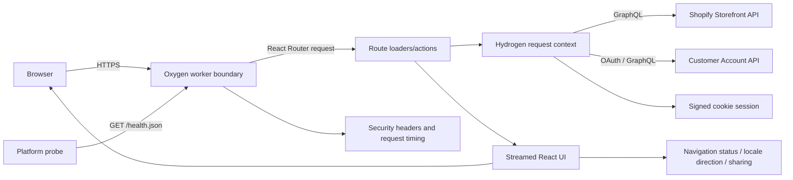
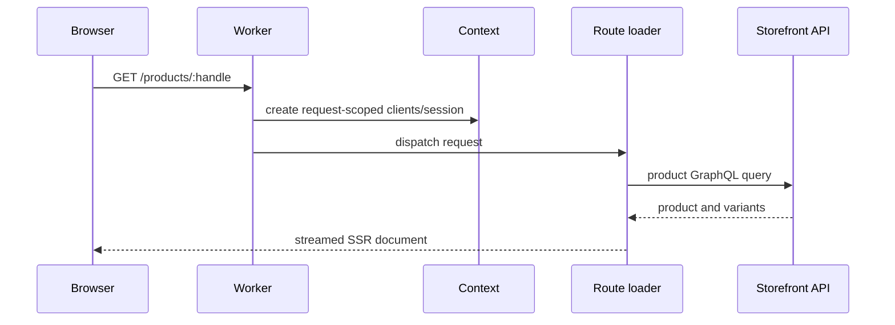
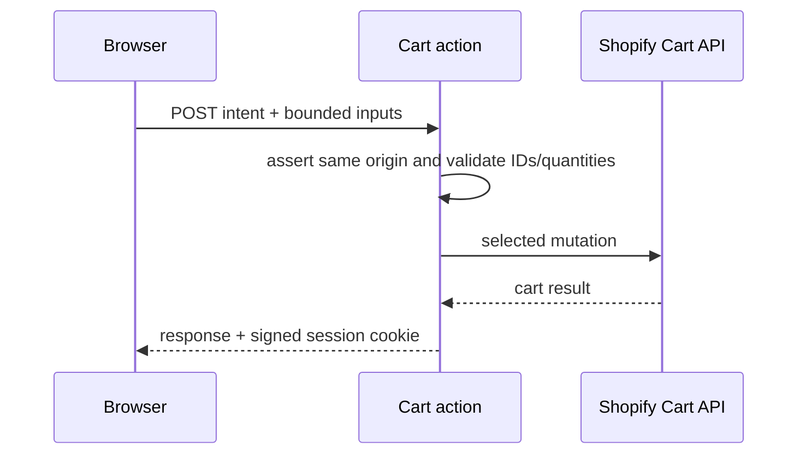
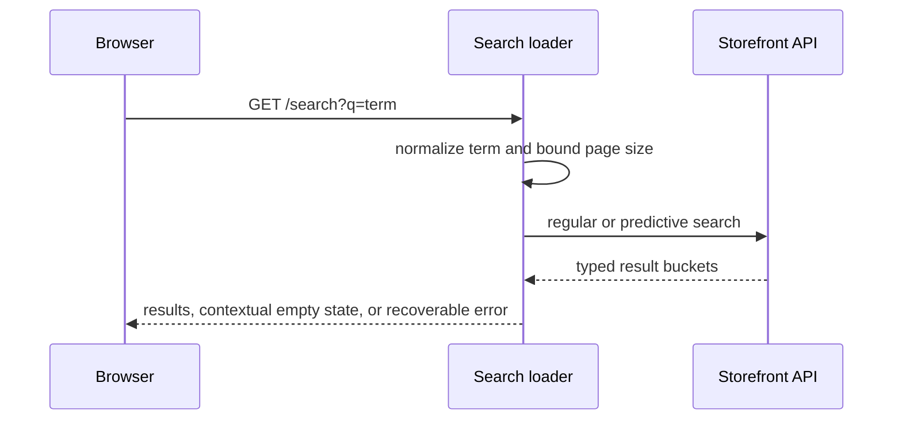
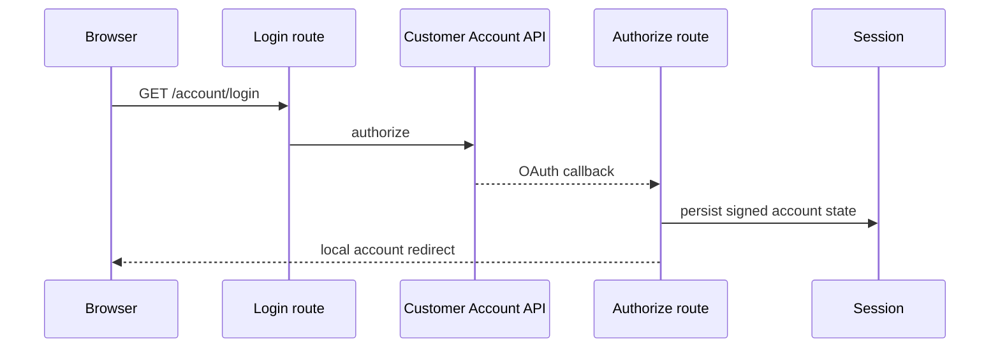

# Architecture and behavioral specification

## System overview

YAS Store is a server-rendered Shopify Hydrogen storefront deployed to the Oxygen worker runtime. React Router file routes own page loaders and mutations; the root loader supplies shared shop, menu, cart, account, locale, consent, and analytics state. Storefront and Customer Account GraphQL access is created per request. The worker boundary validates runtime configuration, persists signed sessions, applies redirects, emits privacy-safe diagnostics, and hardens every response.

## Primary flows

### Catalog page

### Cart mutation

### Search

### Account authentication

## Behavioral contracts

- Mutating browser requests must be same-origin; cross-site fetch metadata or a foreign `Origin` returns 403.
- Cart mutations accept at most 25 lines, quantities from 0/1 through 99 as appropriate, and Shopify resource IDs of the expected kind.
- Search terms are NFKC-normalized, control characters removed, whitespace collapsed, and length bounded to 100 Unicode code points.
- User-controlled redirects remain same-origin paths; protocol-relative, foreign, backslash, and control-character targets fall back safely.
- Account, API, cart, discount, and cookie-setting responses are private and non-cacheable.
- Footer and recommended products are non-critical deferred data: upstream failure must not turn the page into a 500.
- Search distinguishes initial guidance, zero matches, and upstream failure; only one status message is announced.
- Route loading/submission exposes visual progress and a polite live-region update without delaying navigation.
- The Shopify market is selected by validated `PUBLIC_STORE_LANGUAGE` and `PUBLIC_STORE_COUNTRY` values (default EN/US); document direction follows that language.
- Sitemaps emit only canonical routes implemented by the non-prefixed route tree; handles are URL-encoded.
- `/health.json` proves worker context/configuration readiness, is non-cacheable, and discloses only `{"status":"ok"}`.
- Closed drawers are removed from the focus model with `inert`; repeated navigation landmarks have unique accessible names.
- Product sharing prefers the native share sheet, then clipboard, then a selectable URL without making sharing a purchase dependency.
- Production HTTPS responses receive HSTS; all responses receive anti-sniffing, framing, referrer, permissions, request ID, and timing headers.

## Evidence map

| Claim | Evidence | Confidence |
|---|---|---|
| Oxygen request boundary and hardening | `server.js`; `app/lib/http.js` | Confident |
| Request-scoped Shopify clients and session | `app/lib/context.js`; `app/lib/session.js` | Confident |
| File-based route surface | `app/routes.js`; `app/routes/*.jsx` | Confident |
| Cart trust-boundary validation | `app/routes/cart.jsx`; `app/lib/validation.js` | Confident |
| Search normalization and states | `app/routes/search.jsx`; `app/lib/search.js` | Confident |
| OAuth behavior depends on Shopify configuration | account routes and runtime environment | Probable until exercised against a configured store |
| Market configuration and direction | `app/lib/env.js`; `app/lib/context.js`; `app/lib/locale.js` | Confident |
| Canonical sitemap output | `app/routes/sitemap.$type.$page[.xml].jsx`; readiness tests | Confident |
| Probe contract | `app/routes/health[.json].jsx`; readiness tests | Confident |

## Visual and motion layer

`app/styles/motion.css` is the single motion contract: durations, easing, route timing, stagger, and spring presets. Native View Transitions are progressive enhancement. `AmbientEffects` owns one delegated rAF loop for pointer light, magnetic controls, hero tilt, scroll parallax, and marquee depth; IntersectionObserver reveals each element once and the no-JS default remains visible. CSS limits effects to transform/opacity. Reduced-motion disables decorative movement, contrast preference strengthens tokens, and coarse pointers avoid tracking.

The product layer adds focal image inspection, feature-gated CSS-3D card tilt, optimistic button/cart feedback, quick view, related products, and client-only recently viewed/wishlist state. `ProductModelViewer` reads only real Shopify `Model3d` sources and lazy-loads pinned Apache-2.0 `<model-viewer>` code only when both source and opt-in feature flag exist; the Shopify image/poster is always the fallback. Continuous orbit/scan animations were removed after the frame guard failed, retaining input/scroll-driven depth at a measured 59.7 fps.

## Browser test boundary

`E2E_MOCK_MODE` is accepted only as an explicit runtime binding. It replaces Storefront query/cart methods after the normal Hydrogen context is created, preserving the real router, SSR, hydration, forms, CSP, sessions, optimistic cart, and components. Fixture data is deterministic and request/session scoped. Production never enters this branch unless the binding is deliberately enabled. Playwright uses this boundary for nine non-skipped browser checks, axe scans, visual regression, RTL switching, no-JS behavior, and local CWV/event/frame measurements.

## Build and delivery

Node 22 and npm are required. `npm ci` installs the locked graph, `npm run check` performs lint/format/tests/audit, and `npx shopify hydrogen build` creates the client and Oxygen server bundles. CI repeats those gates. Runtime values are documented in `.env.example`; secrets must never be committed.
