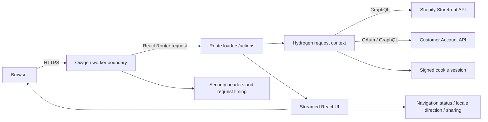
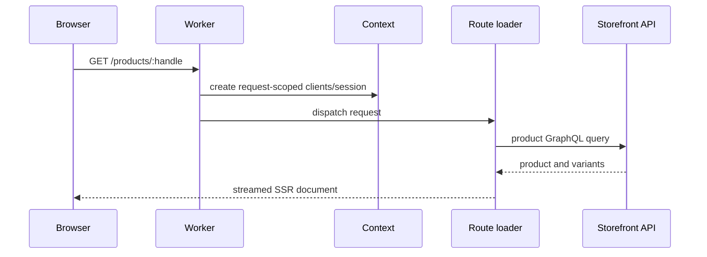
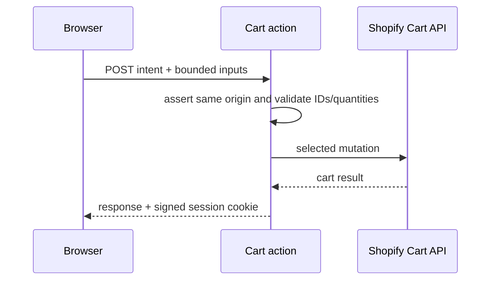
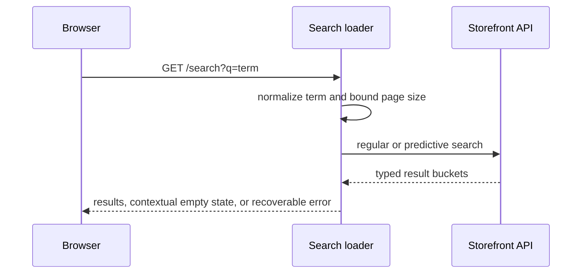
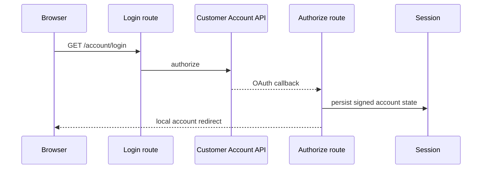

# Architecture and behavioral specification

## System overview

YAS Store is a server-rendered Shopify Hydrogen storefront deployed to the Oxygen worker runtime. React Router file routes own page loaders and mutations; the root loader supplies shared shop, menu, cart, account, locale, consent, and analytics state. Storefront and Customer Account GraphQL access is created per request. The worker boundary validates runtime configuration, persists signed sessions, applies redirects, emits privacy-safe diagnostics, and hardens every response.

## Primary flows

### Catalog page

### Cart mutation

### Search

### Account authentication

## Behavioral contracts

- Mutating browser requests must be same-origin; cross-site fetch metadata or a foreign `Origin` returns 403.
- Cart mutations accept at most 25 lines, quantities from 0/1 through 99 as appropriate, and Shopify resource IDs of the expected kind.
- Search terms are NFKC-normalized, control characters removed, whitespace collapsed, and length bounded to 100 Unicode code points.
- User-controlled redirects remain same-origin paths; protocol-relative, foreign, backslash, and control-character targets fall back safely.
- Account, API, cart, discount, and cookie-setting responses are private and non-cacheable.
- Footer and recommended products are non-critical deferred data: upstream failure must not turn the page into a 500.
- Search distinguishes initial guidance, zero matches, and upstream failure; only one status message is announced.
- Route loading/submission exposes visual progress and a polite live-region update without delaying navigation.
- Document languages are validated and known right-to-left locales emit `dir="rtl"`; malformed locale values fall back to English/LTR.
- Product sharing prefers the native share sheet, then clipboard, then a selectable URL without making sharing a purchase dependency.
- Production HTTPS responses receive HSTS; all responses receive anti-sniffing, framing, referrer, permissions, request ID, and timing headers.

## Evidence map

| Claim | Evidence | Confidence |
|---|---|---|
| Oxygen request boundary and hardening | `server.js`; `app/lib/http.js` | Confident |
| Request-scoped Shopify clients and session | `app/lib/context.js`; `app/lib/session.js` | Confident |
| File-based route surface | `app/routes.js`; `app/routes/*.jsx` | Confident |
| Cart trust-boundary validation | `app/routes/cart.jsx`; `app/lib/validation.js` | Confident |
| Search normalization and states | `app/routes/search.jsx`; `app/lib/search.js` | Confident |
| OAuth behavior depends on Shopify configuration | account routes and runtime environment | Probable until exercised against a configured store |

## Build and delivery

Node 22 and npm are required. `npm ci` installs the locked graph, `npm run check` performs lint/format/tests/audit, and `npx shopify hydrogen build` creates the client and Oxygen server bundles. CI repeats those gates. Runtime values are documented in `.env.example`; secrets must never be committed.
