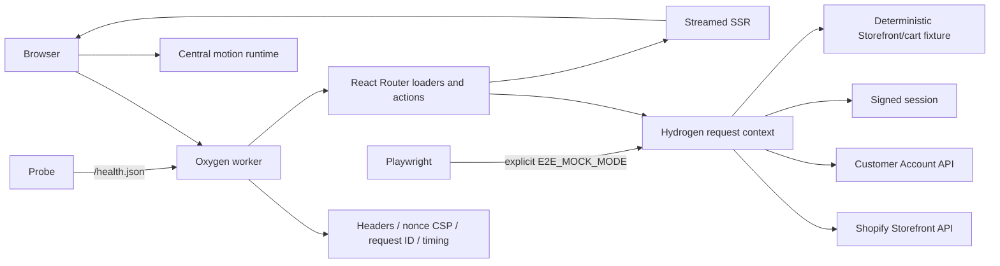

# Phase 7 — premium production delivery

## 1. Authorization, classification, and success

Scope remains the authorized MIT-licensed checkout of `YASLOGIST/as-store-v1yas-frontend`; no authentication, licensing, credential, private-data, or third-party asset bypass occurred. **Classification:** edge-rendered Shopify commerce storefront. Success means premium interaction quality without fabricated commerce claims, inaccessible fallbacks, skipped browser gates, or regressions beyond explicit JS/CSS/CWV budgets.

## 2. Reconstructed architecture and trust boundaries

The mock boundary replaces only Storefront/cart methods after normal Hydrogen context creation, so tests exercise the production router, SSR, hydration, forms, sessions, optimistic UI, CSP, components, and styles. Production behavior is unchanged unless the explicit binding is set. Detailed flows and invariants remain in `docs/ARCHITECTURE.md`.

## 3. Premium motion and visual system

- `app/styles/motion.css` is the only timing source: instant/fast/base/slow/route durations, standard/enter/exit easing, stagger, soft spring, and pop spring.
- Native View Transitions animate route roots where supported; ordinary React Router navigation remains the fallback.
- One delegated runtime handles IntersectionObserver reveal, grid stagger, scroll depth, marquee depth, pointer light, magnetic controls, and hero perspective without React render loops.
- Hero depth uses CSS perspective and pointer/scroll custom properties; product cards have feature-gated CSS-3D hover tilt.
- Product media has focal-point smooth pan/zoom with unchanged static image behavior on touch, no-JS, and reduced-motion paths.
- Add-to-cart morphs to a success state; cart icon/count pulse; quantity controls give transform-only feedback.
- Quick view uses the native modal dialog; wishlist and recently viewed are local client preferences based only on products actually returned/visited.
- Glass, gradient mesh, glow, multi-layer shadow, and original CSS noise remain dependency-free.
- Perpetual hero orbit/scan and auto-marquee loops were **removed** after the first frame comparison fell to 35 fps. Input/scroll-driven depth retained the visual effect at ~60 fps.

## 4. Commerce, performance, RTL, and resilience upgrade

- Product and collection discovery retain intent/viewport prefetch; product cards now use viewport prefetch and View Transitions.
- Shopify `Image` continues to generate responsive sources/sizes; aspect ratios, lazy/eager loading, LCP priority, and visual placeholders remain explicit.
- System font stacks eliminate font downloads, FOIT, licensing risk, and font-induced CLS; Arabic uses a local Tahoma/Arial/system preference.
- Predictive search retains debouncing and fetcher cancellation. Cart forms remain optimistic and now expose success feedback.
- Product pages add a mobile sticky purchase row, real `quantityAvailable` low-stock text, deferred Shopify recommendations, recently viewed history, quick view, and wishlist state.
- No delivery estimate, free-shipping threshold, review, or rating is rendered because those data are not present in the API contract.
- Market switching posts to a same-origin route, validates against `PUBLIC_STORE_MARKETS`, stores only an allow-listed locale cookie, and updates Hydrogen API context plus HTML language/direction.
- Logical properties and explicit RTL exceptions cover modal controls and motion direction; axe, reduced-motion, contrast preference, keyboard dialog, skip link, and no-JS paths are gated.
- Risky features have independent public runtime kill switches. Model viewing is off by default.

## 5. 3D readiness and asset provenance

No WebGL library is included in the normal application bundle. The Product query now reads genuine Shopify `Model3d` media. When and only when a model exists and `PUBLIC_FEATURE_MODEL_VIEWER=true`, the viewport-adjacent component loads pinned `@google/model-viewer@4.1.0` from jsDelivr and supplies Shopify source/poster data. Before load, on failure, with JS disabled, or with the flag off, the regular Shopify image remains visible.

Asset and license evidence is in `docs/ASSET-PROVENANCE.md`. Added visuals are original CSS; fonts are OS-local; `<model-viewer>` is Apache-2.0; axe is MPL-2.0; test Chromium packaging is MIT. No external stock image, font, video, audio, texture, shader, or model was introduced.

## 6. Quality gates and executed evidence

| Gate | Final result |
|---|---:|
| Unit/characterization | 76/76 across 12 files |
| Focused security | 26/26 |
| npm audit | 0 vulnerabilities |
| ESLint / formatting / static a11y | pass / pass / zero warnings |
| Oxygen production build | pass |
| Playwright local mock | 9/9, no skips |
| axe WCAG A/AA | zero violations on tested states |
| Visual regression | pass, 1.5% maximum pixel tolerance |
| RTL market switch | pass, AR/EG RTL → EN/US LTR |
| Reduced motion | pass |
| No-JS product baseline | pass |
| Lighthouse CI | enforced in `.github/workflows/ci.yml` via `lighthouserc.json` |

Lighthouse CI enforces performance ≥0.85, accessibility ≥0.95, best practices/SEO ≥0.90, LCP ≤2.5 s, CLS ≤0.1, and TBT ≤200 ms against home, product, and search in a mocked production preview.

## 7. Measured baseline versus final and guardrail decisions

| Metric | Previous-pass baseline | Final premium pass | Budget / result |
|---|---:|---:|---|
| Largest JS gzip | 44.6 KiB | 44.6 KiB | ≤50 KiB — pass |
| Total JS gzip | 138.3 KiB | 141.0 KiB | ≤150 KiB — pass; +2.6 KiB |
| Total CSS gzip | 9.1 KiB | 10.3 KiB | ≤12 KiB — pass; +1.4 KiB |
| Reduced-motion control FPS | not instrumented | 58.3 fps | local headless control |
| Premium steady-state FPS | not instrumented | 60.7 fps | ≥85% of control — pass |
| Local LCP | not instrumented | 296 ms | ≤2,500 ms — pass |
| Local interaction event | not instrumented | 104 ms | ≤200 ms — pass |
| Local CLS | not instrumented | 0 | ≤0.1 — pass |
| Browser flows | 3 skipped | 9 passed | no skips |

The initial premium implementation measured ~35 fps against a ~59 fps reduced-motion control and failed. Continuous orbit, scan, pulse, and marquee loops plus compositor scroll timelines were downgraded to pointer/scroll/one-shot behavior. Repeated guard runs then measured 58–60 fps, LCP 256–368 ms, CLS 0, and interaction events 104–184 ms. This downgrade is intentional and retained in code.

## 8. Operations, flags, rollback, and handoff

Public flags: `PUBLIC_FEATURE_PREMIUM_MOTION`, `PUBLIC_FEATURE_POINTER_EFFECTS`, `PUBLIC_FEATURE_PRODUCT_TILT`, `PUBLIC_FEATURE_MODEL_VIEWER`, `PUBLIC_FEATURE_QUICK_VIEW`, and `PUBLIC_FEATURE_RECENTLY_VIEWED`. Market configuration: `PUBLIC_STORE_LANGUAGE`, `PUBLIC_STORE_COUNTRY`, and `PUBLIC_STORE_MARKETS`. Model viewing remains false by default.

Run `npm ci`, `npm run check`, `npm run build:ci`, `npm run check:performance`, and `npm run test:e2e`. The browser suite creates a clearly fake ignored `.env.e2e`, expands a pinned headless binary, starts local Hydrogen, and executes without credentials. Use `npm run test:e2e:update` only after visually reviewing intentional output.

All additions are additive and migration-free. Effects can be disabled independently through runtime configuration; commerce still works with reduced motion, no JS, no local storage, absent recommendations, absent model media, or model-loader failure. Configured staging checkout/account smoke testing remains necessary because payment and OAuth must never be simulated as production evidence.
